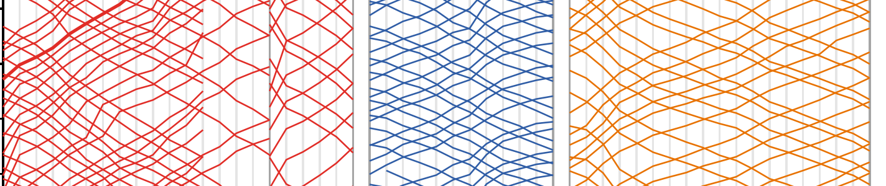

# Statistical Learning

## Week 1

### Monday

No class

### Wednesday

- Course Logistics
- Guess My Age
- **For next time:**
    - Sign up for slack group
    - Set up github account
    - Read p. 1 - 14

## Week 2

### Monday
- Github portfolios
- Estimating f
- **For next time:**
   - Read p 15 - 41
   - Problem Set 1 due beginning of next class

### Wednesday
- Decomposing MSE
- Bias - Variance Tradeoff
- If time: start Lab 1
- **For next time:**
    - Read p 59 - 81
    - Lab 1 due by start of next class
    
    
## Week 3

### Monday
- k-nearest neighbors (KNN)
- Linear Regression
- **For next time:**
   - Read p 82 - 92
   - Lab 2 due at beginning of class next Monday

### Wednesday
- Extending the linear model
- **For next time:**
    - Read p 92 - 109
    - Finish Lab 2

## Week 4

### Monday
- Review MSE for KNN (from Lab 2)
- Geometry of MLR (housing prices activity)
- Assesssing Model Fit
- **For next time:**
    - Work on Lab 3
    
### Wednesday
- Diagnostics
    - Model Validity
    - Outliers
    - Transformations
    - Multicollinearity
- **For next time:**
    - Lab 3 due *Friday* at noon
    

## Week 5

### Monday
- Regression Competition Results
- Automated Model Selection
- **For next time:**
    - Revise `lab-03.Rmd` according to Activity at end of slides
    - Read p. 203 - 227
    
### Wednesday
- Penalized Regression
    - Ridge
    - Lasso
- **For next time:**
    - Lab 4
    
    
## Week 6

### Monday
- Classification
    - KNN
    - Logistic Regression
- **For next time:**
    - Read p. 127 - 149
    
### Wednesday
- Discriminant Analysis
- **For next time:**
    - Lab 5 due Wednesday
    - Read p. 149 - 154
    
    
## Week 7

### Monday
- Classification Errors
- Extending Discriminant Analysis
- **For next time:**
    - Lab 5 due
    - Study!
    
### Wednesday
- Midterm I

## Week 8

### Monday
- Resampling
    - Validation sets
    - Leave-one-out CV
    - k-fold CV
- **For next time:**
    - Read p. 175-197
    
### Wednesday
- Bootstrap

## Week 9

### Monday
- Regression Trees
- Classification Trees
- **For next time:**
    - Read p. 303-321

### Wednesday
- Empowering the Tree
- Variable Importance
- Random Forests
- **For next time:**
    - Read p. 321-324
    - Group Proposals due 11:59 pm Thursday.
    
## Week 10

### Monday
- Boosting