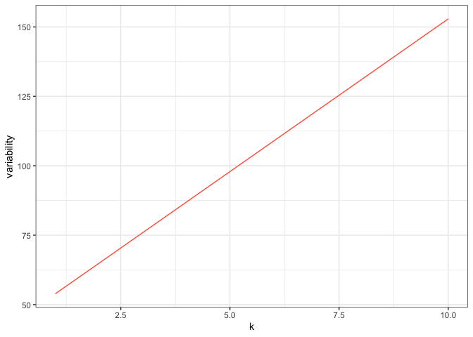

## Lab 2: Linear Regression

### An Island Never Cries

1000 large seimic events around Fiji have been collected in a data set
called `quakes` that is built into R. You can learn more about it with
the following commands:

``` r
data(quakes)
str(quakes)
?quakes
```

#### Earthquake detection

Included in the data set is a column recording the number of stations
that detected each earthquake. This refers to a global network of
seismographs and it stands to reason that the larger the quake, the more
widely it will be detected.

1.  Create a plot of the relationship between `stations` and
    `magnitude`. How would you characterize the relationship? (If you
    see overplotting, you may want to add `jitter` to your points or
    make them transparent by playing with the `alpha` value.)

2.  Before you go ahead and fit a linear model to this trend, if in fact
    there was *no relationship* between the two, what would you expect
    the slope to be? What about the intercept?

3.  Ok, now go ahead and fit a linear model called `m1` to the trend and
    add that line to the plot from exercise 1. Interpret your slope and
    intercept in the context of the problem.

4.  Verify the way that `lm()` has computed your slope correctly by
    using R to do the calculation using the equation for the slope based
    on X and Y.

5.  Using R, calculate a 95% confidence interval for the slope of the
    model that you fit in exercise 3. Confirm the calculation using
    `confint()`.

6.  How many stations do you predict would be able to detect an
    earthquake of magnitude 7.0?

7.  Questions 1 - 6 in this lab involve elements of *data description*,
    *inference*, and/or *prediction*. Which was the dominant goal in
    each question?

-----

### Simulation

One good way to assess whether your fitted model seems appropriate is to
simulate data from it and see if it looks like the data that you
observed. For the following questions it will be useful to reference the
R code provided in the previous two lectures.

9.  Please simulate a data set that has the same number of observations
    as `quakes`. To start, generate a vector of x’s. You can either
    generate your own x’s or use the exact same x’s as the `quakes`
    data.

10. Next, generate your \(\hat{y}\)’s (the value of the mean function at
    the observed x’s). Please generate them by writing your own function
    of the form:

<!-- end list -->

``` r
f_hat <- function(x) {
  # code goes here
}
```

11. Now, generate the y’s. Note that you’ll need an estimate of
    \(\sigma^2\), for which you can use \(\hat{\sigma}^2 = RSS/n - 2\).
    You can extract the vector of residuals with `m1$res`.

12. Finally, make a plot of your simulated data. How is it similar to
    the original data? How is it different? How might you change your
    model to make it more consistent with the data?

**Challenge problem** Use the latitude and longitude data to plot each
of these earthquakes in `quakes` on a map with their magnitude mapped to
the size of the plotting character. You may need to ad some transparency
to prevent overplotting.

-----

# Problem Set 2:

#### Chapter 3 exercises

1, 4, 5

#### Additional exercise

The k-nearest neighbor regression was defined as:

\[\hat{f}(x) = \frac{1}{k} \sum_{x_i \in \mathcal{N}(x)} y_i\]

This is one of the few models that has a closed form for the bias and
the variance. Calculate each and use them to write a decomposition of
the expected test MSE its three components. This is an emminently
google-able result, but doing so will teach you nothing, so work to do
this yourself (or working with each other). It’s not an extensive
derivation at all, you just have to be sure you’re careful in your
notation. If you’re new to , draw examples from the source files on the
website. Please post to slack if you have questions.

One you have a form for each of these terms, construct a plot that shows
the decomposition of the MSE into its components as a function of \(k\)
(this is a formal version of your sketch from the handout). Use the
following as your training data set:

``` r
library(tidyverse)
x <- c(1:3, 5:12)
y <- c(-7.1, -7.1, .5, -3.6, -2, -1.7,
       -4, -.2, -1.2, -1.2, -3.5)
df_train <- tibble(x, y)
```

And the following example of how to plot a function of \(k\) (with the
training data fixed).

``` r
my_fun <- function(k, x, y) {
  f_k <- rep(NA, length(k))
  for (i in 1:length(k)) {
    f_k[i] <- sum(k[i] + y + x)
  }
  f_k
}

k <- 1:10
f_k <- my_fun(k, x, y)

df <- tibble(k = k, f_k = f_k)
ggplot(df, aes(x = k, y = f_k)) +
  geom_line(col = "tomato") +
  theme_bw() +
  ylab("variability")
```

<!-- -->

The final component that you’ll need is a form of \(f\), the true
regression function. This is unknown in practice, but let’s say here
that we know it to be:

\[f = -9.3 + 2.6 x - 0.3 x^2 + .01 x^3\]
