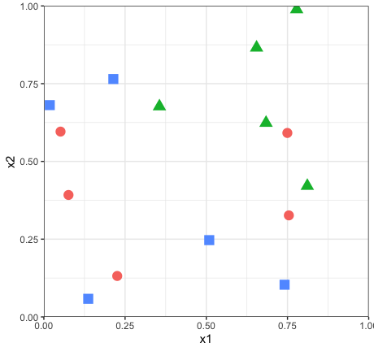

## Lab 7: When a guest arrives they will count how many sides it has on

In class, we estimated by eye the first split in a classification tree
for the following shapely data set. Now let’s check to see if our
graphical intuition agrees with that of the full classification tree
algorithm.

#### 1\. Growing the full classification tree

Use the `trees` package in R to fit a full unpruned tree to this data
set, making splits based on the *Gini index*. You can find the code to
do this in the slides from week 8 or in the lab at the end of Chapter 8
in the book. Please plot the resulting tree.

1.  The two most common splits that we saw in class were a horizontal
    split around \(X_2 \approx 0.50\) and a vertical split around
    \(X_1 \approx 0.30\). Was either of these the first split decided
    upon by your classification tree?
2.  What is the benefit of the second split in the tree?
3.  Which class would this model predict for the new observation with
    \(X_1 = 0.21, X_2 = 0.56\)?

#### 2\. An alternate metric

Now refit the tree based on the *deviance* as the splitting criterion
(you set this as an argument to the `tree()` function). The deviance is
defined for the classification setting as:

\[ -2 \sum_m \sum_k n_{mk} \log \hat{p}_{mk}\]

Plot the resulting tree. Why does this tree differ from the tree fit
based on the Gini Index?

-----

### Crime and Communities, revisited

In Lab 3, you fit a regression model to a training data set that
predicted the crime rate in a community as a function of properties of
that community.

#### 3\. Growing a pruned regression tree

Fit a regression tree to the *training* data using the default splitting
criteria (here, the deviance is essentially the RSS). Next, perform
cost-complexity pruning and generate a plot showing the relationship
between tree size and deviance to demonstrate the size of the best tree.
Finally, construct the tree diagram for this best tree.

#### 4\. Comparing predictive performance

Use this tree to compute the MSE for the *test* data set. How does it
compare to the test MSE for your regression model?

#### 5\. Growing a random forest

We now apply methods to decrease the variance of our estimates. Fit a
`randomForest()` model that performs only bagging and no actual random
forests (recall that bagging is the special case of random forests with
\(m = p\)). Next, fit a second random forest model that uses
\(m = p/3\). Compute their test MSEs. Is this an improvement over the
vanilla pruned regression tree? Does it beat your regression model?

#### 6\. Variance importance

One thing we lose by using these computational techniques to limit the
variance is the clearly interpretable tree diagram. We can still salvage
some interpretability by considering `importance()`. Please construct a
Variable Importance Plot (`varImpPlot()`). Are these restults
similar/different from your interpretation of your regression
coefficients in Lab 3?

-----

### Two Cultures

One of the most influential papers in statistical learning was written
by Leo Breiman, who did much of the groundbreaking work with trees:
[Statistical Modeling: The Two
Cultures](http://projecteuclid.org/download/pdf_1/euclid.ss/1009213726)
(*Statistical Science*, 2001, Vol. 16, No. 3, 199–231). Please start
reading this paper for discussion in class.
