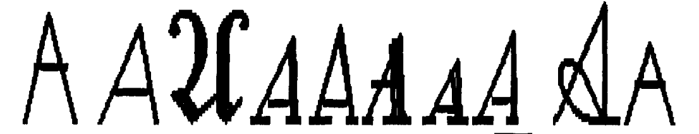

## Lab 8: Ransom notes keep falling

One of the most useful applications to come out of classification models
has been character (i.e. letter) recognition. In this lab, we build our
own character recognition system using boosted trees.

### The data

Our data set consists of a catalog of the features extracted from 20,000
images of letters. They can be loaded in with the following
code.

``` r
lettersdf <- read.csv("https://raw.githubusercontent.com/stat-learning/course-materials/master/data/letters.csv",
                      header = FALSE)
```

Initially, the each image was made up of 45 x 45 pixels, where each was
characterized as either “on” or “off” (black or white). In order to
extract more meaningful predictors from the data, resesearchers \[^1\]
went through and performed *feature extraction*, collapsing those 2025
dimensions into 16, each of which is a summary statistic calculated on
the image. They are as follows:

1.  (The actual letter that the image corresponds to.)
2.  The horizontal position, counting pixels from the left edge of the
    image, of the center of the smallest rectangular box that can be
    drawn with all “on” pixels inside the box.
3.  The vertical position, counting pixels from the bottom, of the above
    box.
4.  The width, in pixels, of the box.
5.  The height, in pixels, of the box.
6.  The total number of “on” pixels in the character image.
7.  The mean horizontal position of all “on” pixels relative to the
    center of the box and divided by the width of the box. This feature
    has a negative value if the image is “left- heavy” as would be the
    case for the letter L.
8.  The mean vertical position of all “on” pixels relative to the center
    of the box and divided by the height of the box.
9.  The mean squared value of the horizontal pixel distances as measured
    in 6 above. This attribute will have a higher value for images whose
    pixels are more widely separated in the horizontal direction as
    would be the case for the letters W or M.
10. The mean squared value of the vertical pixel distances as measured
    in 7 above.
11. The mean product of the horizontal and vertical distances for each
    “on” pixel as measured in 6 and 7 above. This attribute has a
    positive value for diagonal lines that run from bottom left to top
    right and a negative value for diagonal lines from top left to
    bottom right.
12. The mean value of the squared horizontal distance times the vertical
    distance for each “on” pixel. This measures the correlation of the
    horizontal variance with the vertical position.
13. The mean value of the squared vertical distance times the horizontal
    distance for each “on” pixel. This measures the correlation of the
    vertical variance with the horizontal position.
14. The mean number of edges (an “on” pixel immediately to the right of
    either an “off” pixel or the image boundary) encountered when making
    systematic scans from left to right at all vertical positions within
    the box. This measure distinguishes between letters like “W” or “M”
    and letters like ‘T’ or “L.”
15. The sum of the vertical positions of edges encountered as measured
    in 13 above. This feature will give a higher value if there are more
    edges at the top of the box, as in the letter “Y.”
16. The mean number of edges (an “on” pixel immediately above either an
    “off” pixel or the image boundary) encountered when making
    systematic scans of the image from bottom to top over all horizontal
    positions within the box.
17. The sum of horizontal positions of edges encountered as measured in
    15 above.

In addition, each row/image was labeled with the letter that it
corresponds to.

You will want to build your model on a training data set and evaluate
its performance on a separate test data set. Please use the following
indices to subset out the training data set, leaving the remaining as
test.

``` r
set.seed(1)
train <- sample(1:nrow(lettersdf), nrow(letterdf) * .75)
```

### Building a boosted tree

Contruct a boosted tree to predict the class of the training images (the
letters) based on its 16 features. This can be done with the `gbm()`
function in the library of the same name. Look to the end of chapter 8
for an example of the implementation. Note that we’ll be performing a
boosted *classification* tree. It’s very similar to the boosted
regression tree except the method of calculating a residual is adapted
to the classification setting. Please use as your model parameters
\(B = 50\), \(\lambda = 0.1\), and \(d = 1\). Note that this is
computationally intensive, so it may take a minute to run. Which
variable is found to be the most important?

### Assessing predictions

Now use this boosted model to predict the classes of the images in the
test data set. Use the same number of trees and be sure to add the
argument `type = "response"`. The output of this will be a 5000 X 26 X 1
array: for each image you’ll have a predicted probability that it is
from each of the 26 classes. To extract the vector of length 5000 of
each final predicted class, you can use the following function.

``` r
predicted <- LETTERS[apply(yhat, 1, which.max)]
```

Where `yhat` is the output of the `predict()` function.

1.  Build a cross-tabulation of the predicted and actual letters (a 26 X
    26 confusion matrix).
2.  What is your misclassification rate? (the function `diag()` might be
    helpful)
3.  What letter was most difficult to predict?
4.  Are there any letter pairs that are particularly difficult to
    distinguish?

### Slow the learning

Build a second boosted tree model that uses even *slower* learners, that
is, decrease \(\lambda\) and increase \(B\) somewhat to compensate (the
slower the learner, the more of them we need). Pick the parameters of
your choosing for this, but be wary of trying to fit a model with too
high a \(B\). You don’t want to wait an hour for your model to fit.

1.  How does the misclassification rate compare to the rate from you
    original model?
2.  Are there any letter pairs that became particularly easier/more
    difficult to distinguish?

(Data come from: P. W. Frey and D. J. Slate. “Letter Recognition Using
Holland-style Adaptive Classifiers”. (Machine Learning Vol 6 \#2 March
91) )

-----

## Communities and Crime

Return to the Communities and Crime data set.

### One last boost

Construct a model based on a boosted tree with parameters of your
choosing. How does the test MSE compare to your existing models (Bagged
Trees, Random Forests, etc.)?

-----

## Chapter 8 exercises

Numbers 5 and 6 (be sure to put 6 in your own words).
