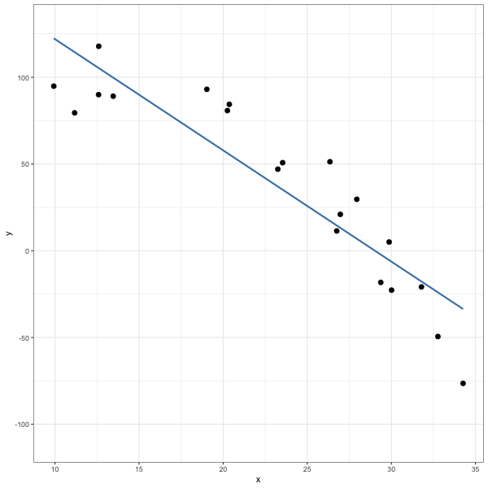
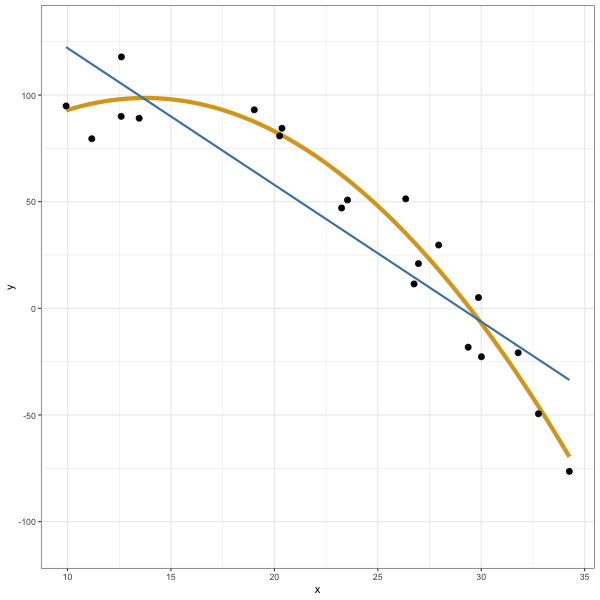
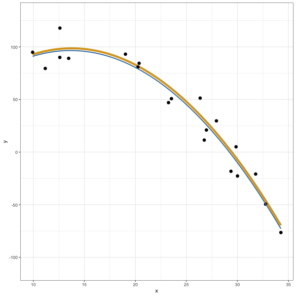
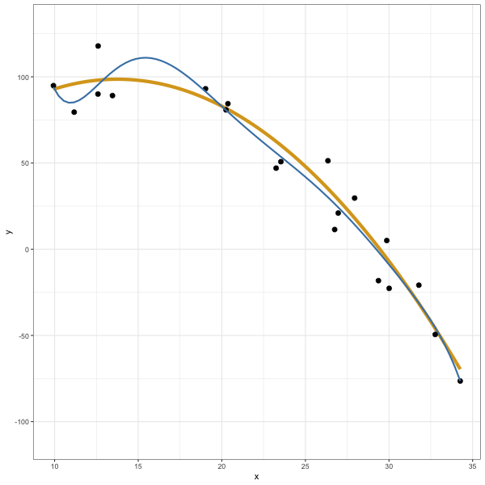

```{r setup, include = FALSE}
knitr::opts_chunk$set(fig.width = 8,
                      fig.align = "center",
                      message = FALSE, 
                      warning = FALSE,
                      fig.retina = 3)
library(tidyverse)
library(gganimate)
theme_set(theme_bw())
```

```{r echo = FALSE, eval = FALSE, fig.width=6, fig.height = 6}
set.seed(500)
n <- 20
it <- 20
x <- runif(n, 5, 35)
x <- rep(x, it)
f <- function(x) {
  23 + 11 * x - .4 * x^2
}
y <- f(x) + rnorm(length(x), mean = 0, sd = 11)
df <- tibble(x = x, y = y, sim = rep(1:it, each = n))

options(gganimate.dev_args = list(width = 600, height = 600))
p <- ggplot(df, aes(x = x, y = y)) +
  geom_point(size = 2.5) + 
  stat_smooth(method = "lm", 
              se = FALSE, 
              color = "steelblue") +
  ylim(-110, 130) +
  transition_states(sim,
                      transition_length = 2,
                      state_length = 1) +
  ease_aes('cubic-in-out') +
  shadow_mark(alpha = .3, color = "lightgrey")

anim <- animate(p, nframes = 500)
anim_save("many-draws.gif")
```


```{r out.width=620, echo = FALSE, fig.align='center'}

```

---

# Generating from Generative Models

Many statistical models are **generative**: they represent probability distributions
from which we're able to take random samples. That is, once you have the model
(true or estimated) you are able to generate as much data as you like.


---
# Simulation from true model (ex: polynomial regression)

True mean function:
$$
\begin{array}
\textrm{f}(x) &= \beta_0 + \beta_1 x + \beta_2 x^2 \\
&= 23 + 4 x - 3.2 x^2
\end{array}
$$

--

True data generating function:

$$
y = f(x) + \epsilon; \quad \epsilon \sim N(0, 11) \\
$$

$$
Y|X \sim N(\mu = f(x), \, \sigma = 11)
$$

--

```{r}
n <- 20
x <- runif(n, min = 5, max = 35)
f <- function(x) {
  23 + 11 * x - .4 * x^2
}
y <- rnorm(length(x), mean = f(x), sd = 11)
```


---

$$
f(x) = \beta_0 + \beta_1 x + \beta_2 x^2
$$

```{r echo = FALSE}
df <- data.frame(x = x, y = y)
p1 <- ggplot(df, aes(x = x, y = y)) + 
  ylim(c(-110, 130)) +
  ylab("y")
p1 + stat_function(fun = f, color = "goldenrod", lwd = 2)
```


---

$$
y = \beta_0 + \beta_1 x + \beta_2 x^2 + \epsilon; \, n = 20
$$

```{r echo = FALSE}
p1 + stat_function(fun = f, color = "goldenrod", lwd = 2) +
  geom_point()
```


---

$$
y = \beta_0 + \beta_1 x + \beta_2 x^2 + \epsilon; \, n = 20000
$$

```{r echo = FALSE, warning = FALSE}
x <- runif(20000, 5, 35)
df_pt <- data.frame(x = x, y = rnorm(length(x), mean = f(x), sd = 11))
p1 + geom_point(data = df_pt, aes(x = x, y = y), alpha = .1) +
  stat_function(fun = f, color = "goldenrod", lwd = 2)
```


---

# Visualizing Bias and Variance

## Procedure

1. Assume true generative model

--

2. Generate data set of size $n$

--

3. Estimate $\hat{f}$

--

4. Repeat 2 and 3 many times to get a sense of the variation in $\hat{f}$


## Estimating $\hat{f}$

Let's naively assume a *linear form*, work with data sets of size 20, and fit 
$\hat{f}$ by least squares.

$$
f(x) = \beta_0 + \beta_1 x
$$

---

```{r echo = FALSE, eval = FALSE, fig.width=6, fig.height = 6}
set.seed(500)
n <- 20
it <- 20
x <- runif(n, 5, 35)
x <- rep(x, it)
f <- function(x) {
  23 + 11 * x - .4 * x^2
}
y <- f(x) + rnorm(length(x), mean = 0, sd = 11)
df <- tibble(x = x, y = y, sim = rep(1:it, each = n))

options(gganimate.dev_args = list(width = 600, height = 600))
p <- ggplot(df, aes(x = x, y = y)) +
  stat_function(fun = f, color = "goldenrod", lwd = 2) +
  geom_point(size = 2.5) + 
  stat_smooth(method = "lm", 
              se = FALSE, 
              color = "steelblue") +
  ylim(-110, 130) +
  transition_states(sim,
                      transition_length = 2,
                      state_length = 1) +
  ease_aes('cubic-in-out') +
  shadow_mark(alpha = .3, color = "lightgrey")

anim <- animate(p, nframes = 500)
anim_save("many-draws-2.gif")
```

```{r out.width=620, echo = FALSE, fig.align='center'}

```


---

```{r echo = FALSE, eval = FALSE, fig.width=6, fig.height = 6}
set.seed(500)
n <- 20
it <- 20
x <- runif(n, 5, 35)
x <- rep(x, it)
f <- function(x) {
  23 + 11 * x - .4 * x^2
}
y <- f(x) + rnorm(length(x), mean = 0, sd = 11)
df <- tibble(x = x, y = y, sim = rep(1:it, each = n))

options(gganimate.dev_args = list(width = 600, height = 600))
p <- ggplot(df, aes(x = x, y = y)) +
  stat_function(fun = f, color = "goldenrod", lwd = 2) +
  geom_point(size = 2.5) + 
  stat_smooth(method = "lm", 
              se = FALSE, 
              formula = y ~ poly(x, 2),
              color = "steelblue") +
  ylim(-110, 130) +
  transition_states(sim,
                      transition_length = 2,
                      state_length = 1) +
  ease_aes('cubic-in-out') +
  shadow_mark(alpha = .3, color = "lightgrey")

anim <- animate(p, nframes = 500)
anim_save("many-draws-3.gif")
```

## Estimating $\hat{f}$, take two

Next, let's presciently assume a quadratic form...

---

```{r out.width=620, echo = FALSE, fig.align='center'}

```

---
## Estimating $\hat{f}$, take three (or seven?)

Finally, let's get ridiculous and assume a septic form...

---

```{r echo = FALSE, eval = FALSE, fig.width=6, fig.height = 6}
set.seed(500)
n <- 20
it <- 20
x <- runif(n, 5, 35)
x <- rep(x, it)
f <- function(x) {
  23 + 11 * x - .4 * x^2
}
y <- f(x) + rnorm(length(x), mean = 0, sd = 11)
df <- tibble(x = x, y = y, sim = rep(1:it, each = n))

options(gganimate.dev_args = list(width = 600, height = 600))
p <- ggplot(df, aes(x = x, y = y)) +
  stat_function(fun = f, color = "goldenrod", lwd = 2) +
  geom_point(size = 2.5) + 
  stat_smooth(method = "lm", 
              se = FALSE, 
              formula = y ~ poly(x, 7),
              color = "steelblue") +
  ylim(-110, 130) +
  transition_states(sim,
                      transition_length = 2,
                      state_length = 1) +
  ease_aes('cubic-in-out') +
  shadow_mark(alpha = .3, color = "lightgrey")

anim <- animate(p, nframes = 500)
anim_save("many-draws-4.gif")
```

```{r out.width=620, echo = FALSE, fig.align='center'}

```
