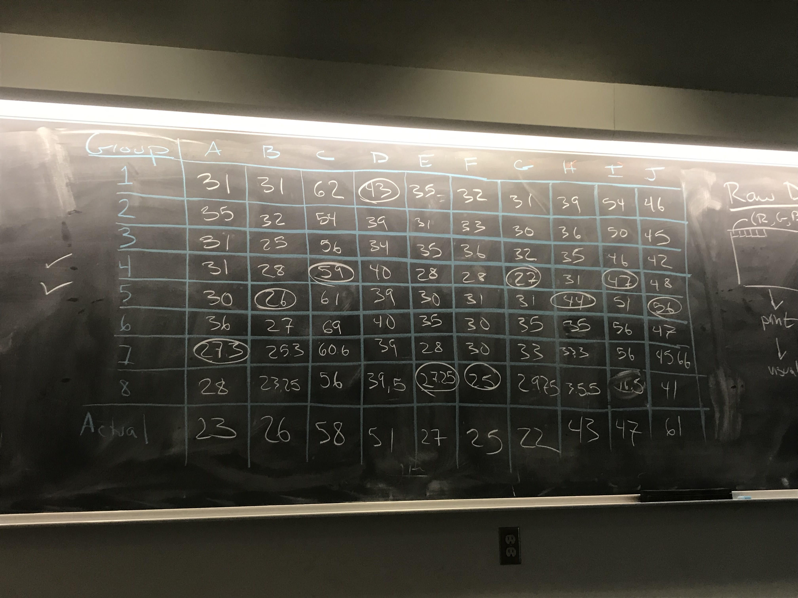
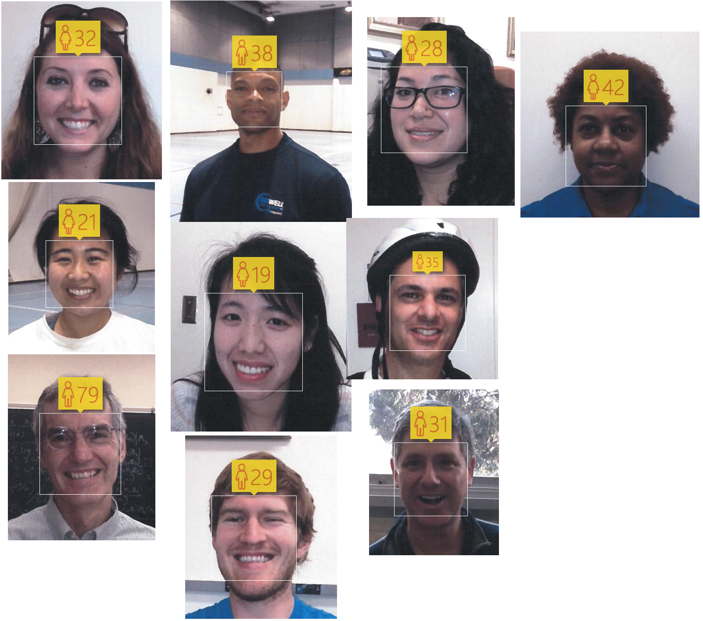

```{r setup, include = FALSE}
knitr::opts_chunk$set(fig.width = 13, 
                      message = FALSE, 
                      warning = FALSE)
```

# Create repo-project

1. Accept invite to `stat-learning`.

--

2. Create New Repo
    - Title: `firstname-lastname`
    - Make it private

--
3. Link repo to rstudio project
    - Log into `rstudio.reed.edu`
    - Create new project from version control
    - Grab url for repo from github
    - Title: `stat-learning`
    - Initialize with README.md

---
#  Submitting assignments

1. Edit README.md

    - Add name, date, course, any other relevant biographical info
    - Save file

--
2. Commit and push the change

    - Click box next to changed file in Git pane and click commit
    - Add message `initial commit` then commit
    - Click up arrow to push the change

--
3. Verify the push
    - Go to github and see if the file changed

    
---
# Problem Set 1

1. Download template

    - `github.com/stat-learning/course-materials/problem-sets/ps-template.Rmd`

--
2. Upload to RStudio Server

    - Click `Upload` in file pane

--
3. Commit and push

    - Add name to file and save
    - Commit, add message, and push

    
---
# Video walkthroughs

These are from Math-241 Data Science, but the general process is the same.

A. [Linking Github to RStudio](https://www.dropbox.com/s/eqhqfyzm5jlfmyv/github-rstudio-A.mov?dl=0)

Differences:
- I have not created your repo - you will do / have done that.
- You should probably put your first problem set in a folder called `problem-sets`.
- You're welcome to download the template from `course-materials` or modify the default as shown in video.

B. [Committing and Pushing](https://www.dropbox.com/s/g9odv0vcvs8ze3g/github-rstudio-B.mov?dl=0)


---
# Video walkthroughs, cont.

C. [Using .gitignore](https://www.dropbox.com/s/l6uepmbxgihz3f5/github-rstudio-C.mov?dl=0)

D. [Caching credentials](https://www.dropbox.com/s/1w1or55bssef11v/github-rstudio-D.mov?dl=0)

---
# Guess My Age Scorecard

```{r out.width=800, echo = FALSE, fig.align='center'}

```


---
# Man vs Machine

```{r out.width=400, echo = FALSE, fig.align='center'}

```

--

```{r}
mean((c(23, 26, 58, 51, 27, 25, 22, 43, 47, 61) - 
      c(32, 21, 79, 38, 19, 29, 28, 35, 31, 42))^2)
```

