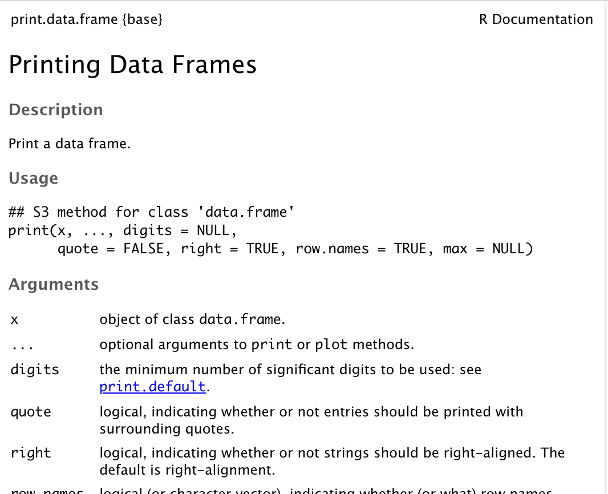
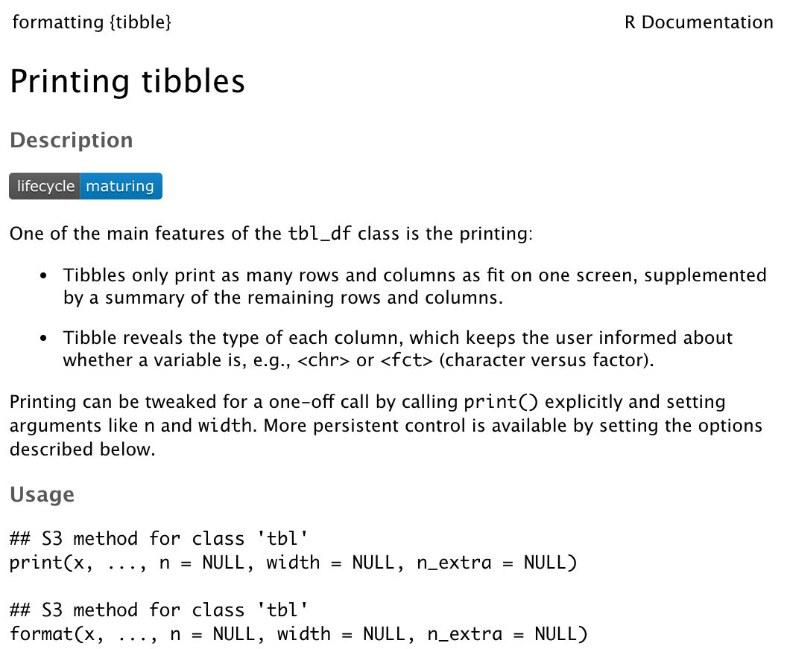

# Example: Credit

Can we predict the balance that someone will carry on their Credit card?

--

.tiny[
```{r message = FALSE}
library(ISLR)
library(tidyverse)
data(Credit)
dim(Credit)
head(Credit)
```
]

---
# Least Squares

```{r}
m1 <- lm(Balance ~ ., data = Credit)
summary(m1)$coef
```


---
class: small

# Ridge regression

```{r model_matrix, message = FALSE, eval = FALSE}
X <- model.matrix(Balance ~ ., data = Credit)[, -1]
X[1:2, ]
```

--

```{r ref.label = "model_matrix", message = FALSE, echo = FALSE}
```

--

```{r message = FALSE}
Y <- Credit$Balance
lambdas <- seq(from = 1e4, to = 1e-2, length.out = 100)
library(glmnet)
rm1 <- glmnet(x = X, y = Y, alpha = 0, 
              lambda = lambdas, standardize = TRUE)
class(rm1)
```

---
class: small

# Digression: classes and methods in R

Certain functions in R have different *methods* (i.e. functionality) when used on objects of different *class*.

--

```{r}
slice(iris, 1:3)
```

---

# Methods for `numeric`

```{r sep1}
sepal_length <- iris$Sepal.Length
class(sepal_length)
```

--

```{r sep_summary, eval = FALSE}
summary(sepal_length)
```

--

```{r ref.label = "sep_summary", echo = FALSE}
summary(sepal_length)
```

---

# Methods for `numeric`, cont.

--

```{r sep_plot, eval = FALSE}
plot(sepal_length)
```

--

```{r ref.label = "sep_plot", echo = FALSE, fig.height = 6, fig.width = 6, fig.align="center"}
plot(sepal_length)
```

---
class: small

# Methods for `lm`

--

```{r lm_fit, eval = FALSE}
lm1 <- lm(Sepal.Length ~ Sepal.Width + Petal.Length, 
         data = iris)
class(lm1)
```

--

```{r ref.labl = "lm_fit", echo = FALSE}
lm1 <- lm(Sepal.Length ~ Sepal.Width + Petal.Length, 
         data = iris)
class(lm1)
```

--

```{r lm_sum, eval = FALSE}
summary(lm1)
```

--

```{r ref.label = "lm_sum", echo = FALSE}
summary(lm1)
```

---
class: small

# Methods for `lm`, cont.

--

```{r lm_qplot, eval = FALSE}
par(mfrow = c(2, 2))
plot(lm1)
```

--

```{r ref.label = "lm_qplot", echo = FALSE, fig.height = 6, fig.width = 6, fig.align="center"}
par(mfrow = c(2, 2))
plot(lm1)
```

---
class: small

# Why does this happen?

Compare this:

--

```{r iris, eval = FALSE}
iris
```

--

```{r ref.label = "iris", echo = FALSE}
iris
```

---
class: small

# Why does this happen? cont.

. . . to this:

--

```{r iristr, eval = FALSE}
tibble(iris)
```

--

```{r ref.label = "iristr", echo = FALSE}
tibble(iris)
```


---
class: small

# Different classes, different methods

--

```{r classiris, eval = FALSE}
class(iris)
```

--

```{r ref.label = "classiris", echo = FALSE}
class(iris)
```

--

```{r sclassiris, eval = FALSE}
class(tibble(iris))
```

--

```{r ref.label = "sclassiris", echo = FALSE}
class(tibble(iris))
```

---

--

```{r}
?print.data.frame
```

--

```{r out.width=620, echo = FALSE, fig.align='center'}

```


---

--

```{r}
?print.tbl
```

--

```{r out.width=620, echo = FALSE, fig.align='center'}

```


---
class: small

# Back to ridge regression...

--

```{r rm1, eval = FALSE}
rm1 <- glmnet(x = X, y = Y, alpha = 0, 
              lambda = lambdas, standardize = TRUE)
class(rm1)
```

--

```{r ref.label = "rm1", echo = FALSE}
rm1 <- glmnet(x = X, y = Y, alpha = 0, 
              lambda = lambdas, standardize = TRUE)
class(rm1)
```

--

```{r summrm1, eval = FALSE}
summary(rm1)
```

--

```{r ref.label = "summrm1", echo = FALSE}
summary(rm1)
```


---
class: small

--

```{r strrm1, eval = FALSE}
str(rm1)
```

--

```{r ref.label = "strrm1", echo = FALSE}
str(rm1)
```

---
class: small

```{r rm11, eval = FALSE}
rm1$lambda[100]
```

--

```{r ref.label = "rm11", echo = FALSE}
rm1$lambda[100]
```

--

```{r lastmodel, eval = FALSE}
coef(rm1)[1:4, 100]
```

--

```{r ref.label = "lastmodel", echo = FALSE}
coef(rm1)[1:4, 100]
```

--

```{r firstmodel, eval = FALSE}
coef(m1)[1:4]
```

--

```{r ref.label = "firstmodel", echo = FALSE}
coef(m1)[1:4]
```


---

```{r, echo = FALSE, eval = TRUE}
l <- rev(rep(lambdas, 3))
a <- as.matrix(coef(rm1)[2:4, ])
v <- c(t(a[, seq(100, 1)]))
coef <- as.factor(rep(row.names(coef(rm1))[2:4], each = length(lambdas)))
df <- data.frame(l, v, coef)

library(ggplot2)
ggplot(df, aes(x = l, y = v, color = coef)) + 
  geom_line()
```


