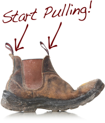

```{r setup, include=FALSE}
knitr::opts_chunk$set(message = FALSE, warning = FALSE)
#xaringan::inf_mr(cast_from = '..')
```

class: small

# Paired Warmup (call this `activity-3.md`)

Using the `Credit` data set in the `ISLR` package, you'll be estimating the 2, 5, and 10 fold CV MSE for a logistic regression model predicting `default` based on `balance`. Start by loading relevant packages and running following code:

```{r include = FALSE}
library(ISLR)
library(tidyverse)
data(Credit)
```

```{r}
set.seed(42)
k <- 2
partition_index <- rep(1:k, each = nrow(Credit)/k) %>%
  sample()
MSE_i <- rep(NA, k)
```

Use the following scaffold to computer to compute three MSE estimates.

```{r}
# add partition index column to Credit data set
for (i in 1:k) {
  # create training data set
  # create test data set
  # fit model
  # use model to predict into test data set
  # store MSE_i
}
# compute final MSE estimate
```


---

```{r out.width=350, echo = FALSE, fig.align='center'}

```

---
# The Bootstrap

A widely applicable and powerful statistical tool used to quantify
the uncertainty of a given estimate or model.

--

## Basic Idea
With a dataset of $n$ obs to which you've fit an estimate $\hat{\theta}$.

--

1. Draw a bootstrap sample, of size $n$ **with replacement**.
--

2. Fit your estimate, $\hat{\theta}^*$ to the bootstrap sample.
--

3. Repeat 1-2 many times and assess the variability in your estimate by looking at the *bootstrap distribution*.


---
# Ex: Simple Regression
--

Is there a relationship between fractionalization and growth?

```{r echo = FALSE, fig.height = 6, message=FALSE, warning = FALSE, fig.align="center"}
war <- read.csv("http://www.stat.cmu.edu/~cshalizi/uADA/15/hw/06/ch.csv")

library(ggplot2)
ggplot(war, aes(fractionalization, growth)) +
  geom_point(alpha = .3) +
  stat_smooth(method = "lm", se = FALSE, col = "orchid") +
  theme_bw()
m1 <- lm(growth ~ fractionalization, data = war)
```


---
# Bootstrapping $\hat{\beta}_1$
--

```{r echo = FALSE, message = FALSE}
library(dplyr)
war <- war %>%
  select(growth, fractionalization) %>%
  na.omit()
```

.tiny[
```{r cache=TRUE}
betas <- rep(NA, 5000)
for(i in 1:5000) {
  boot_ind <- sample(1:nrow(war), 
                     size = nrow(war), 
                     replace = TRUE)
  war_boot <- war[boot_ind, ]
  betas[i] <- coef(lm(growth ~ fractionalization,
                      data = war_boot))[2]
}
```
]

--

```{r echo = FALSE, warning=FALSE, message = FALSE, fig.height=3.2, fig.align = "center"}
df <- data.frame(betas)
ggplot(df, aes(betas)) +
  geom_histogram(col = "white") +
  theme_bw()
```


---
# Bootstrap distribution
--

```{r mean, eval = FALSE}
mean(betas)
```

--

```{r ref.label = "mean", echo = FALSE}
mean(betas)
```

--

```{r sd, eval = FALSE}
sd(betas)
```

--

```{r ref.label = "sd", echo = FALSE}
sd(betas)
```

--

```{r coef, eval = FALSE}
summary(m1)$coef
```

--

```{r ref.label = "coef", echo = FALSE}
summary(m1)$coef
```


---
# A common argument

*Parametric methods have assumptions that often aren't reasonable, therefore the bootstrap is preferable because it's assumption free.*

--

The bootstrap requires a sample that captures the important structure in the data. Difficult with small samples of skewed data.

But it sure is flexible . . .


---
# Bootstrapping $r$
--

Is there a relationship between fractionalization and growth in terms of the **correlation coefficient**?

```{r echo = FALSE, message=FALSE, warning = FALSE, fig.height = 4}
ggplot(war, aes(fractionalization, growth)) +
  geom_point(alpha = .3) +
  stat_smooth(method = "lm", se = FALSE, col = "orchid") +
  theme_bw()
m1 <- lm(growth ~ fractionalization, data = war)
```

r = `r round(cor(war$fractionalization, war$growth), digits = 3)`


---
# Bootstrapping $r$
--

.tiny[
```{r cache=TRUE}
corrs <- rep(NA, 5000)
for(i in 1:5000) {
  boot_ind <- sample(1:nrow(war), 
                     size = nrow(war),
                     replace = TRUE)
  war_boot <- war[boot_ind, ]
  corrs[i] <- cor(war_boot$fractionalization,
                  war_boot$growth)
}
```
]

```{r echo = FALSE, warning=FALSE, message = FALSE, fig.height=3.2, fig.align="center"}
df <- data.frame(corrs)
ggplot(df, aes(corrs)) +
  geom_histogram(col = "white") +
  theme_bw()
```


---
class: small

# Bootstrapping v. CV
--

Both are computationally intensive methods that involve sampling from your data set to learn more about your estimate/model.

--

### Cross-validation
Often used for *model assessment* and *model selection*.

- Partition data into test and train
- Fit model to train, predict on test
- Iterate though all possible *folds* (not for VS)
- Compute aggregate measure of predictive ability

--

### Bootstrapping
Often used for quantifying uncertainty.

- Draw a bootstrap sample of size $n$ from your data *with replacement*.
- Compute estimate of interest
- Consider distribution of bootstrap estimates over many samples


---
# Activity 3, continued

Take a look at the `law82` dataset inside the `bootstrap` package.

Compute a statistic of interest and construct the bootstrap distribution to find its standard error.


---
# Activity 3, continued continued

Take a look at the `law82` dataset inside the `bootstrap` package.

1. Fit two models, linear and quadratic, to predict `GPA` based on `LSAT`.
2. Compute the cross-validated MSE for both models using one of the three methods we've discussed.
3. Bootstrap this statistic to estimate its standard error.
