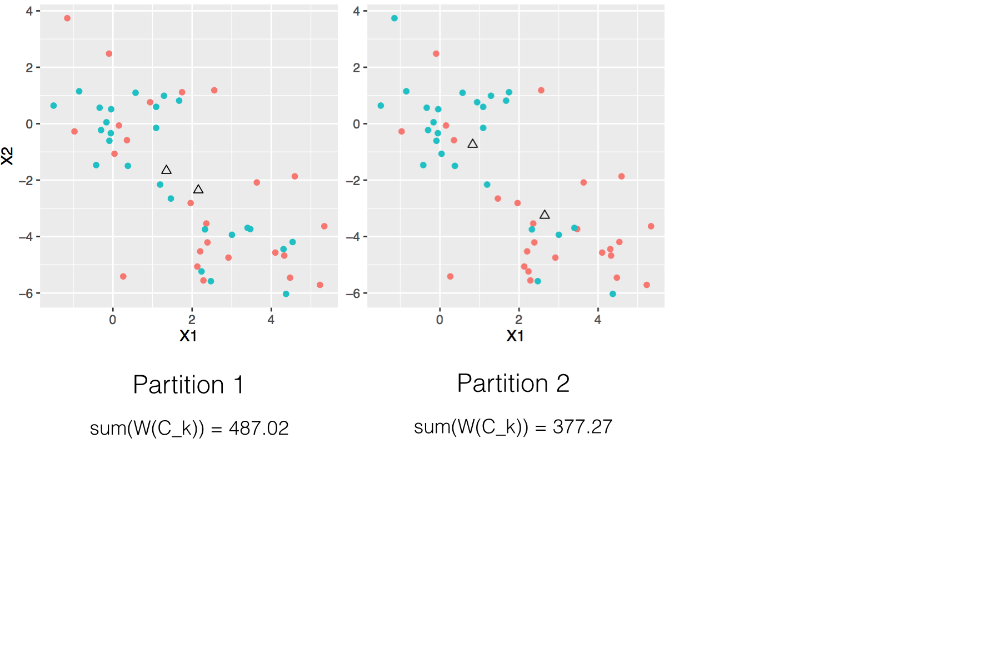
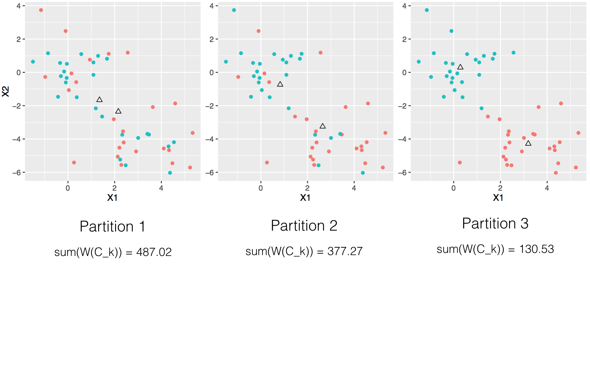
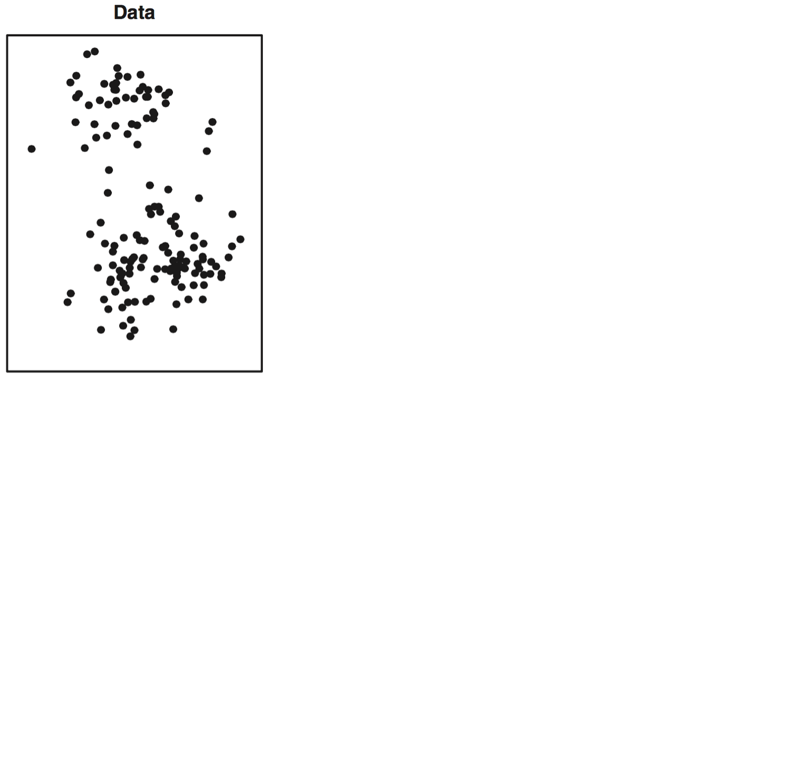
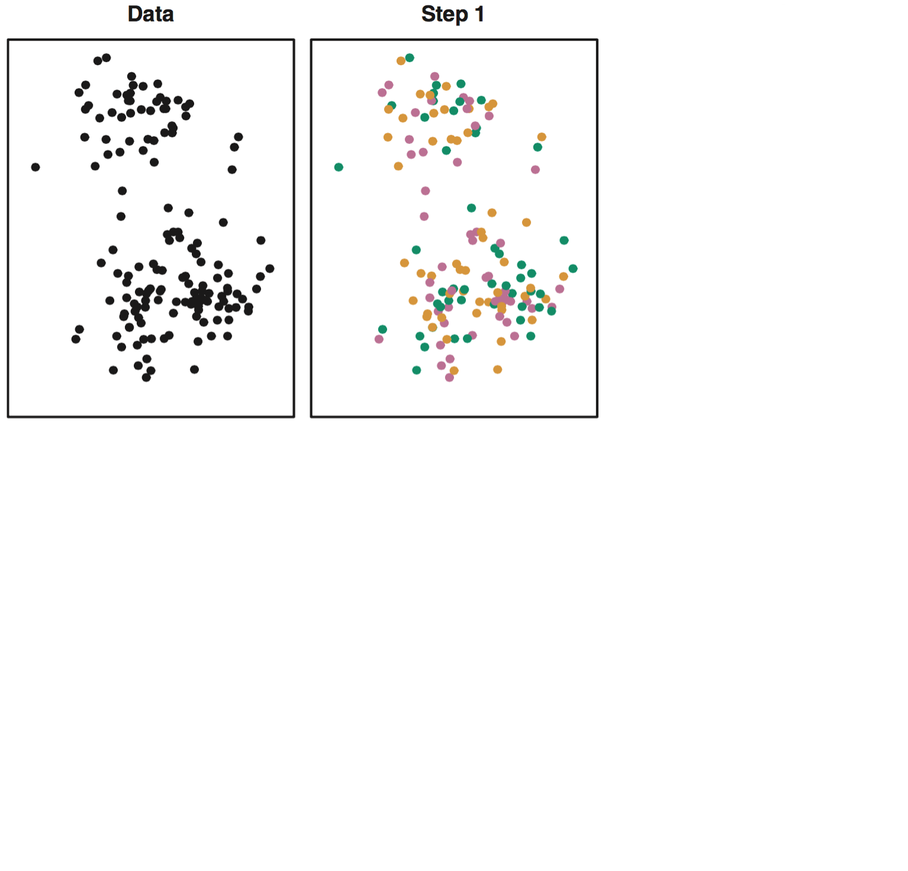
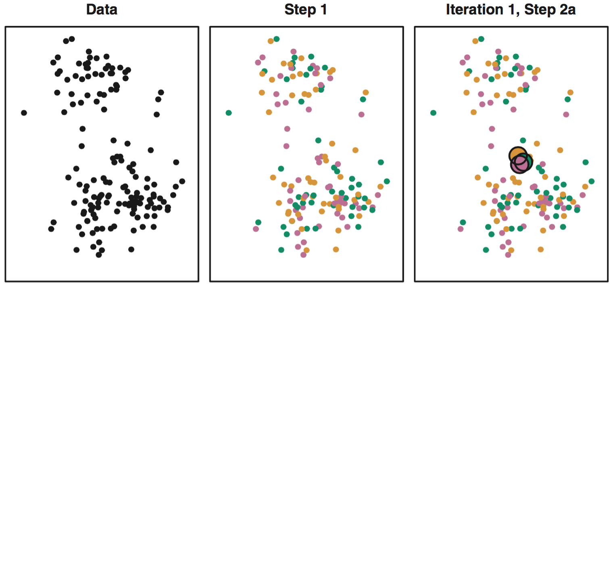
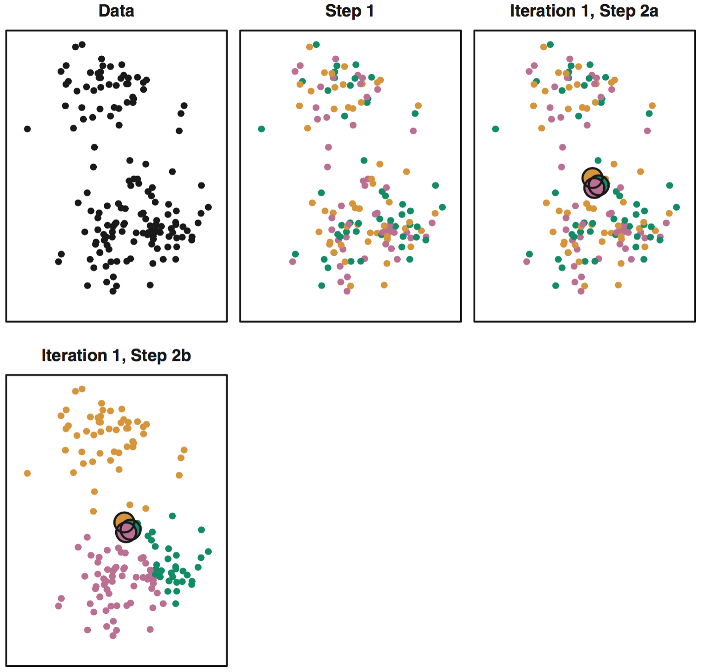
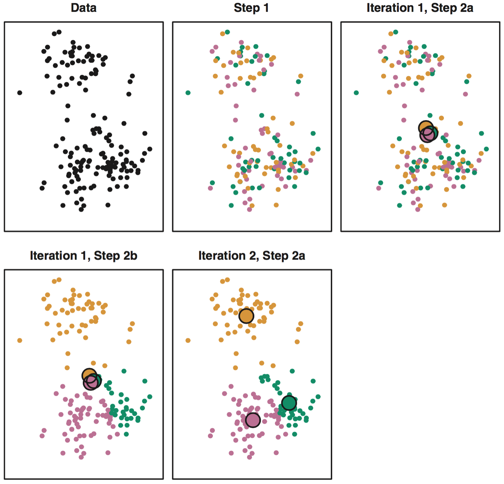
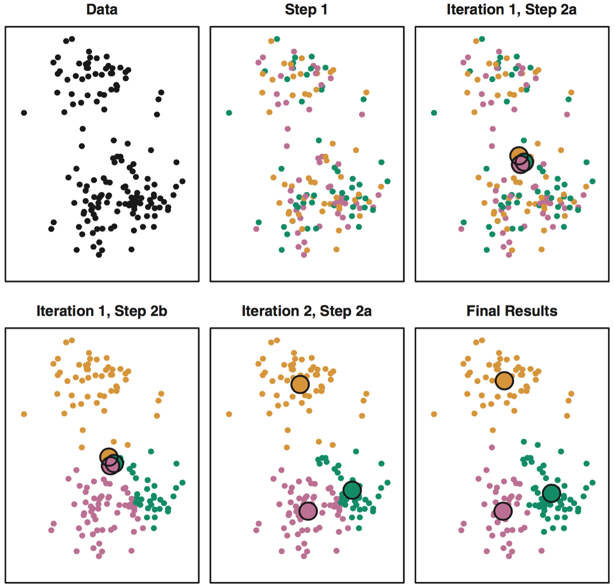

```{r echo = FALSE, warning=FALSE, message=FALSE}
library(knitr)
opts_chunk$set(warning = FALSE, message = FALSE, fig.align = "center")
```

```{r echo = FALSE, message = FALSE}
set.seed(304)
x <- matrix(rnorm(50 * 2), ncol = 2)
x[1:25, 1] <- x[1:25, 1] + 3
x[1:25, 2] <- x[1:25, 2] - 4
library(tidyverse)

d <- data.frame(x, group = as.factor(1))
p0 <- ggplot(d, aes(x = X1, y = X2)) +
  geom_point() + 
  guides(colour=FALSE)

group <- as.factor(rep(1:2, each = 25))
d <- data.frame(x, group)
dc <- d %>%
  group_by(group) %>%
  summarize(meanX1 = mean(X1),
            meanX2 = mean(X2),
            SS1 = 24 * var(X1),
            SS2 = 24 * var(X2))
#sum(dc$SS1, dc$SS2)
p1 <- ggplot(d, aes(x = X1, y = X2, col = group)) +
  geom_point(size = 3) + 
  guides(colour = FALSE) +
  labs(x = expression(X[1]),
       y = expression(X[2])) +
  theme_bw(base_size = 18) +
  geom_point(data = dc, aes(x = meanX1, y = meanX2), shape = 2, col = "black", size = 3)

d <- data.frame(x, group = group[c(1:15, 26:35, 16:24, 35:50)])
dc <- d %>%
  group_by(group) %>%
  summarize(meanX1 = mean(X1),
            meanX2 = mean(X2),
            SS1 = 24 * var(X1),
            SS2 = 24 * var(X2))
#sum(dc$SS1, dc$SS2)
p2 <- ggplot(d, aes(x = X1, y = X2, col = group)) +
  geom_point(size = 3) + 
  guides(colour=FALSE) +
  labs(x = expression(X[1]),
       y = expression(X[2])) +
  theme_bw(base_size = 18) +
  geom_point(data = dc, aes(x = meanX1, y = meanX2), shape = 2, col = "black", size = 3)


d <- data.frame(x, group = group[c(6:25, 46:50, 1:5, 26:45)])
dc <- d %>%
  group_by(group) %>%
  summarize(meanX1 = mean(X1),
            meanX2 = mean(X2),
            SS1 = 24 * var(X1),
            SS2 = 24 * var(X2))
#sum(dc$SS1, dc$SS2)
p3 <- ggplot(d, aes(x = X1, y = X2, col = group)) +
  geom_point(size = 3) + 
  guides(colour=FALSE) +
  labs(x = expression(X[1]),
       y = expression(X[2])) +
  theme_bw(base_size = 18) +
  geom_point(data = dc, aes(x = meanX1, y = meanX2), shape = 2, col = "black", size = 3)
```

```{r echo = FALSE, eval = FALSE}
pdf(file = "plot1.pdf", height = 3.5, width = 3.5)
p1
dev.off()

pdf(file = "plot2.pdf", height = 3.5, width = 3.5)
p2
dev.off()

pdf(file = "plot3.pdf", height = 3.5, width = 3.5)
p3
dev.off()
```

```{r echo = FALSE, fig.align="center", fig.width=5.5}
p0
```

```{r echo = FALSE, eval = FALSE}
library(tidyverse)
set.seed(304)
x <- matrix(rnorm(50 * 2), ncol = 2)
x[1:25, 1] <- x[1:25, 1] + 3
x[1:25, 2] <- x[1:25, 2] - 4

d <- data.frame(x, group = as.factor(1))
p0 <- ggplot(d, aes(x = X1, y = X2)) +
  geom_point(size = 3) + 
  guides(colour=FALSE) +
  labs(x = expression(X[1]),
       y = expression(X[2])) +
  theme_bw(base_size = 18)

set.seed(199)
x1_init <- runif(2, -1.5, 5.5)
x2_init <- runif(2, -6, 4)
p0 + 
  annotate("point", x = x1_init, y = x2_init, size = 2) +
  annotate("point", x = x1_init, y = x2_init, size = 5, pch = 1)

xa_aug <- matrix(c(x1_init[1], x[,1], x1_init[2], x[,2]), ncol = 2)
a <- dist(xa_aug)
a_dists <- a[1:50]

xb_aug <- matrix(c(x1_init[2], x[,1], x1_init[2], x[,2]), ncol = 2)
b <- dist(xb_aug)
b_dists <- b[1:50]

d <- data.frame(x) %>%
  mutate(group = ifelse(a_dists <= b_dists, "A", "B"))

p1 <- ggplot(d, aes(x = X1, y = X2, col = group)) +
  geom_point(size = 3) + 
  guides(colour=FALSE) +
  labs(x = expression(X[1]),
       y = expression(X[2])) +
  theme_bw(base_size = 18) + 
  annotate("point", x = x1_init, y = x2_init, size = 2) +
  annotate("point", x = x1_init, y = x2_init, size = 5, pch = 1)
```

---
# Three initial partitions

```{r out.width=800, echo = FALSE}
knitr::include_graphics("figs/kmeans1.png")
```

---
# Three initial partitions

```{r out.width=800, echo = FALSE}

```

---
# Three initial partitions

```{r out.width=800, echo = FALSE}

```


---
# Algorithm 10.1 
--

1. Randomly assign each obs. to 1 of K clusters.

--

2. Iterate until the clusters stop changing:
    - For each of the K clusters, compute the centroid (i.e. mean vector).
    - Assign each observation to the cluster whose centroid is closest (by Euclidean distance).


---

```{r out.width=600, echo = FALSE}

```

---

```{r out.width=600, echo = FALSE}

```

---

```{r out.width=600, echo = FALSE}

```

---

```{r out.width=600, echo = FALSE}

```

---

```{r out.width=600, echo = FALSE}

```

---

```{r out.width=600, echo = FALSE}

```

---
# Important considerations 

1. The final partition is dependent on initial assignments.
    - *Solution*: run the algorithm several times with different starting conditions and select best.
    
--

2. Consider scaling the variables
    - Scale if you want "similar" to mean close w.r.t. all variables.


---
class:small
## Activity 5 

Use K-means clustering to identify the best 2, 3, and 4 clusterings of US states based on the data in the `poverty`. Use Euclidean distance for your similarity measure.

```{r}
poverty <- read.delim("https://bit.ly/381pd5e")
```


Useful functions:

- `kmeans()`
- `set.seed()`
- `geom_text()` or `ggrepel::geom_text_repel()`

1. What do the variables seem to mean?
2. Find best cluster assignments of size K.
3. Generate a scatterplot of the 51 obs and their first two PCs.
4. Color code each with their cluster assignment.


---

```{r, echo = FALSE, eval = FALSE}
poverty <- read.delim("https://bit.ly/381pd5e")
head(poverty)
set.seed(40)
km1 <- kmeans(poverty[ ,-1], 4, nstart = 20)
pca1 <- prcomp(poverty[, -1])
d <- data.frame(PC1 = pca1$x[, 1],
                PC2 = pca1$x[, 2],
                cluster = as.factor(km1$cluster),
                state = poverty$State)
library(ggrepel)
ggplot(d, aes(x = PC1, y = PC2, col = cluster)) +
  geom_point() +
  geom_text_repel(aes(label = state)) +
  theme_bw()
```

---
# Choosing K

---
# K = 4
--

```{r echo = FALSE}
library(ggrepel)
poverty <- read.delim("https://bit.ly/381pd5e")
km4 <- kmeans(poverty[ ,-1], 4, nstart = 20)
pca1 <- prcomp(poverty[, -1])
d <- data.frame(PC1 = pca1$x[, 1],
                PC2 = pca1$x[, 2],
                cluster = as.factor(km4$cluster),
                state = poverty$State)
ggplot(d, aes(x = PC1, y = PC2, col = cluster)) +
  geom_point() +
  geom_text_repel(aes(label = state)) +
  theme_bw(base_size = 16)
```

---
# K = 3

```{r echo = FALSE}
km3 <- kmeans(poverty[ ,-1], 3, nstart = 20)
pca1 <- prcomp(poverty[, -1])
d <- data.frame(PC1 = pca1$x[, 1],
                PC2 = pca1$x[, 2],
                cluster = as.factor(km3$cluster),
                state = poverty$State)
ggplot(d, aes(x = PC1, y = PC2, col = cluster)) +
  geom_point() +
  geom_text_repel(aes(label = state)) +
  theme_bw(base_size = 16)
```

---
# K = 2

```{r echo = FALSE}
km2 <- kmeans(poverty[ ,-1], 2, nstart = 20)
pca1 <- prcomp(poverty[, -1])
d <- data.frame(PC1 = pca1$x[, 1],
                PC2 = pca1$x[, 2],
                cluster = as.factor(km2$cluster),
                state = poverty$State)
pk2 <- ggplot(d, aes(x = PC1, y = PC2, col = cluster)) +
  geom_point() +
  geom_text_repel(aes(label = state)) +
  theme_bw(base_size = 16)
pk2
```


---
# K = 1

```{r echo = FALSE}
km1 <- kmeans(poverty[ ,-1], 1, nstart = 20)
pca1 <- prcomp(poverty[, -1])
d <- data.frame(PC1 = pca1$x[, 1],
                PC2 = pca1$x[, 2],
                cluster = as.factor(km1$cluster),
                state = poverty$State)
ggplot(d, aes(x = PC1, y = PC2, col = cluster)) +
  geom_point() +
  geom_text_repel(aes(label = state)) +
  theme_bw(base_size = 16)
```


---
# Variation with K = 1

```{r}
names(km1)
km1$withinss
km1$tot.withinss
```


---
# K = 2
--

```{r echo = FALSE}
pk2
```


---
# Variation with K = 2
--

```{r}
km2$withinss
km2$tot.withinss
km2$totss
```

---
## TWSS and K
--

```{r echo = FALSE, fig.width = 9}
km5 <- kmeans(poverty[ ,-1], 5, nstart = 20)
km6 <- kmeans(poverty[ ,-1], 6, nstart = 20)
km7 <- kmeans(poverty[ ,-1], 7, nstart = 20)
km8 <- kmeans(poverty[ ,-1], 8, nstart = 20)
df <- data.frame("K" = 1:8,
                 "SS" = c(km1$tot.withinss,
                          km2$tot.withinss,
                          km3$tot.withinss,
                          km4$tot.withinss,
                          km5$tot.withinss,
                          km6$tot.withinss,
                          km7$tot.withinss,
                          km8$tot.withinss))
ggplot(df, aes(x = K, y = SS)) +
  geom_point(size = 3) +
  geom_line(lwd = 1.5) +
  theme_bw()
```

---
# Selecting K
--

- Use domain area knowledge.

--

- Look for "elbow" in a scree plot.

--

- Formalize "elbow" with Gap statistic (Tibshirani, 2001).

--

The number of clusters is often ambiguous, which shouldn't be surprising in an unsupervised setting.

Choice of K is choosing where on the spectrum between complete aggregation (K = 1) and no aggregation (K = n).


